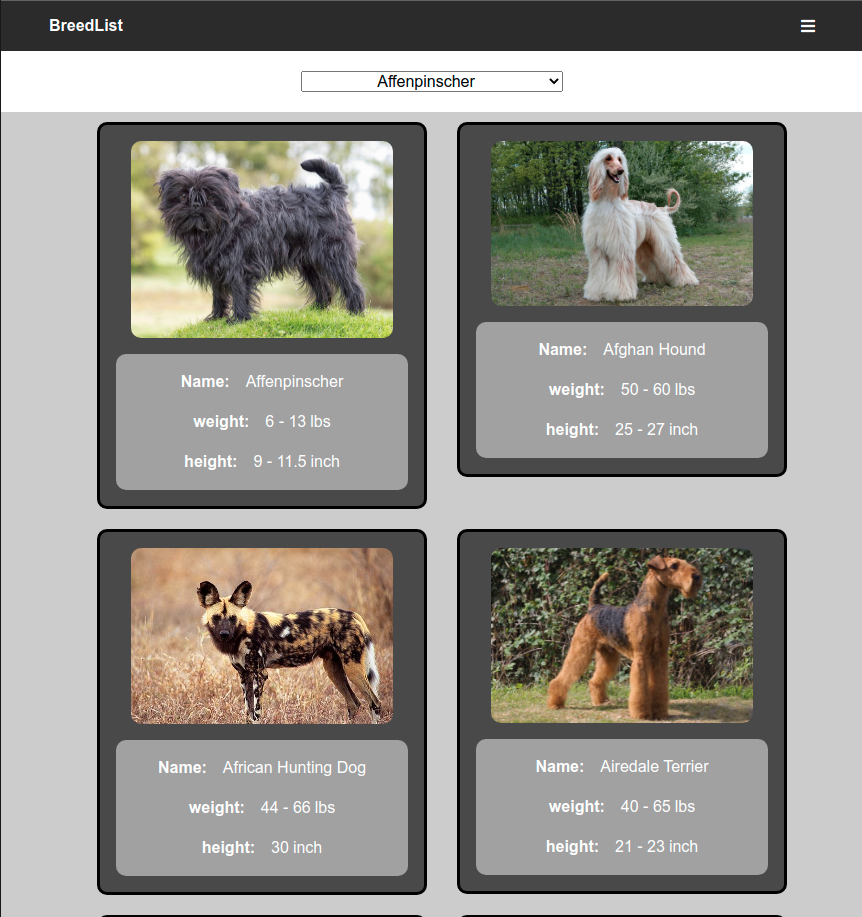
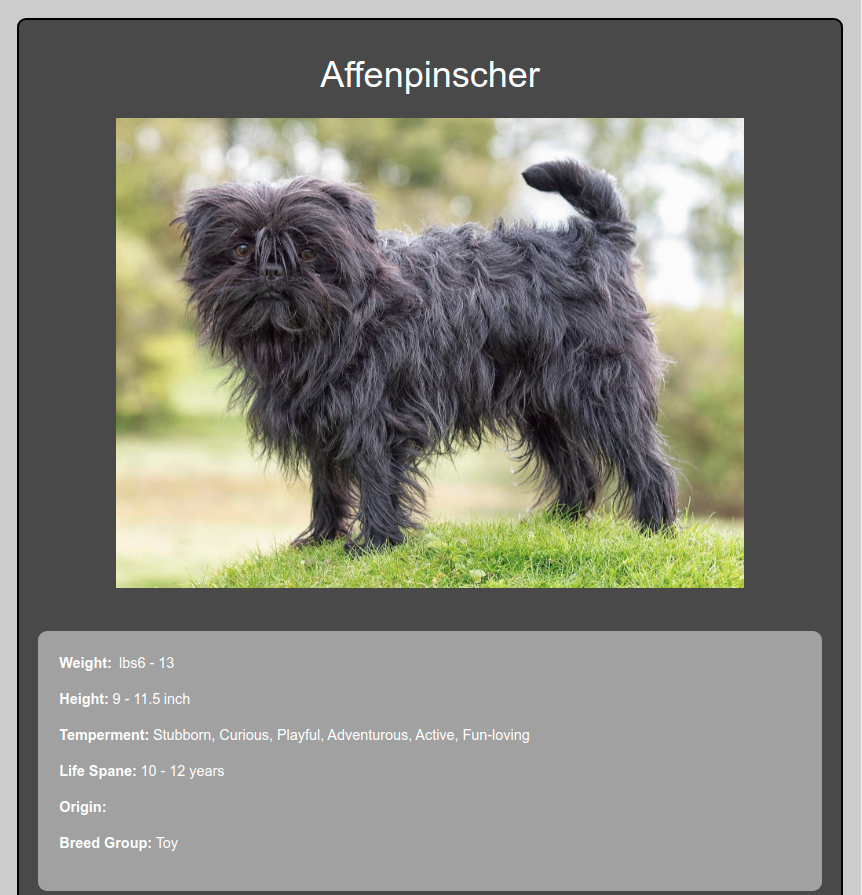

# BreedFacts

> This project is the final capstone for Microverse's React and Redux module with the aim of building a catalog application that consumes an API using external API', React.js and Redux for state management.

<p align="center">
    <a href="https://img.shields.io/badge/Microverse-blueviolet" alt="Contributors">
        </a>
    <a href="https://www.javascript.com/" alt="JS">
        </a>
    <a href="https://webpack.js.org//" alt="Webpack">
        </a>
    <a href="https://eslint.org/" alt="Eslint">
        </a>
    <a href="https://stylelint.io/" alt="Stylelint">
        </a>
</p>

<p align="center">
    <br />
    <br />&#10023;
    <a href="#Prerequisites">Watch the Live Version</a> &#10023;
    <a href="#Prerequisites">Prerequisites</a> &#10023;
    <a href="#Getting-Started">Getting Started</a> &#10023;
    <a href="#Usage">Usage</a> &#10023;
    <a href="#Contributing">Contributing</a> &#10023;
    <a href="#Author">Author</a> &#10023;
    <a href="#Show-your-support">Show your support</a> &#10023;
    <a href="#License">License</a> &#10023;
    <a href="#Acknowledgments">Acknowledgments</a> &#10023;
    <a href="https://github.com/Rashad-Muntar/to-do">Report Bug</a>&#10023;

</p>

<br/>

### Homepage
<b>BreedFact app</b> The main goal of this project is to understand how to work with API modules using React.js and Redux for state management. This application fetches real-time data of top 20 dog breeds. User is able to select breed from dropdown or clicking DogCard and see more information on the breed.

### Homepage


### Details page


## Live Demo

Visit [Live Demo](https://thedoglist.herokuapp.com/)

### Prerequisites

- React.js
- Redux
- Text Editor
- Git
- NodeJS
- Webpack
- Heroku
- Jest
- Semantic UI
- coinstats API

## Getting API from Coinstats
Coinstats API is an open API with no requirement for API key
- Go to `https://thedogapi.com/`
- Copy the global endpoint
- Use API in the application

## How to clone Repo
1. Open your Terminal.
2. Navigate to your desired location to download the contents of this repository.
3. Copy and paste the following code into the Terminal :
   ```bash
   $ git clone git@github.com:RailonA/DogFacts.git
   ```
4. Run `cd dogFacts`
5. Install the needed dependencies 
    ```bash
    $ npm install
    ```
6. In develoment mode run 
    ```bash
    npm start
    ```

### Usage
Lauch the local version of this project opening the `localhost:3000` in your browser

## Contributing

This project was created for educational purposes as part of the Microverse web development curriculum; contributing is not accepted.

Feel free to check the [issues page](https://github.com/RailonA/DogFacts/issues).

## Author

👤 **Railon Acosta**

- GitHub: [@railonA](https://github.com/RailonA)
- Linkedin: [@railonAcosta](https://www.linkedin.com/in/railon-acosta-81265180/)
- Twitter: [@railonAcosta](https://twitter.com/RailonAcosta)


### Show your support

Give a ⭐️ if you like this project!

### Attribution
Coinstats API


## License


This project is licensed under the MIT License
